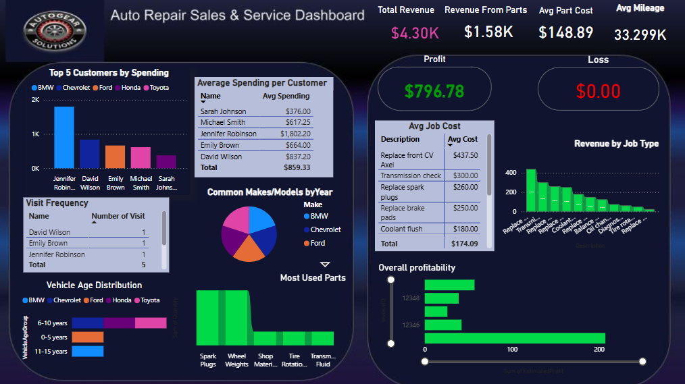

# Car-Repair-Shop-Analysis
# 🔧 Car Repair Shop Sales & Operations Analysis

### 📊 Dimensional Modeling | SQL Analysis | Power BI Dashboards

---

## 📁 Project Structure

```
car-repair-analysis/
│
├── SQL/
│   ├── create_tables.sql
│   ├── import_data.sql
│   └── analysis_queries.sql
│
├── PowerBI_Dashboard/
│   ├── repair_shop_dashboard
│   │   ├── customer_analysis.png
│   │   ├── job_revenue.png
│   │   └── vehicle_distribution.png
│
├── Visualizations/
│   ├── parts_usage_chart.png
│   └── revenue_breakdown.png
│
├── Documentation/
│   ├── ER_Diagram.pdf
│   └── Dimensional_Model_Explanation.pdf
│
├── Data/
│   ├── invoices.csv
│   ├── jobs.csv
│   ├── vehicles.csv
│   ├── parts.csv
│   └── customers.csv
│
└── README.md
```

---

## 🧾 Overview

This project delivers a full-scale **data-driven analysis** of a car repair shop’s sales and operations using dimensional modeling, SQL querying, and **Power BI dashboards**. The insights help optimize service efficiency, customer retention, inventory control, and financial performance.


---

## 🧱 Dimensional Modeling (Part A)

### ✅ Objective:
Design a sales-focused data warehouse schema to analyze:
- Customer spending
- Vehicle service history
- Parts usage
- Service center revenue

### ✨ Dimensional Model Design:
- **Fact Table:** `fact_invoice`
- **Dimensions:** `dim_customer`, `dim_vehicle`, `dim_job`, `dim_part`, `dim_date`

📌 **ER Diagram:** [View PDF](./Documentation/EER%20DIAGRAM.pdf)

---

## ⚙️ Data Ingestion & Preparation

- Cleaned & normalized 5 CSV files
- Created relational schema using MySQL
- Loaded into MySQL database `carrepairshop`
- Indexed key columns for performance

---

## 🛠️ Tools Used

- **MySQL Workbench** – Data modeling & SQL querying  
- **Power BI** – Interactive dashboards and visualizations  
- **Excel** – Data preview & cleaning  
- **Python (Optional)** – Additional visual analysis  

---

## 📊 Power BI Dashboard Highlights

📍 Dashboard Location: [`/PowerBI_Dashboard`](./PowerBI_Dashboard/)

### ✅ Pages & Visuals Included:

| Page Title | Description |
|------------|-------------|
| 💼 Customer Analysis | Top spenders, avg. spend, visit frequency |
| 🚙 Vehicle Insights | Make/model trends, mileage & age stats |
| 🔧 Job Performance | Revenue per job type, cost distribution |
| 🛠️ Parts Usage | Most used parts, part cost trends |
| 💰 Financial Summary | Monthly revenue, profit, sales tax impact |

🌟 Built using **card visuals, bar charts, pie charts, stacked columns, scatter plots**, and **KPI indicators**.

---

## 🔍 Key Findings

| Metric | Value |
|--------|-------|
| Total Revenue (incl. tax) | `$4,296.65` |
| Job Revenue | `$1,914.50` |
| Parts Revenue | `$1,584.87` |
| Net Profit | `$371.78` |
| Avg Customer Spend | `$859.33` |
| Avg Vehicle Mileage | `33,299` miles |

---

## 💡 Actionable Recommendations

✅ **Operational Enhancements**
- Focus on high-margin services like CV axle replacements
- Improve efficiency of low-profit services

📦 **Inventory Optimization**
- Stock top-used parts like spark plugs, wheel weights
- Set reorder alerts

👥 **Customer Loyalty**
- Target high-spenders with loyalty/discount programs
- Incentivize repeat visits (currently 1 per customer)

🗓️ **Scheduling Optimization**
- Prioritize recurring job types for faster turnaround
- Streamline service delivery workflow

📊 **Financial Strategy**
- Monitor monthly revenue & tax impact
- Forecast cash flow using Power BI insights

---

## 📂 Repository Highlights

- 📄 SQL Queries: [`SQL/analysis_queries.sql`](./SQL/analysis_queries.sql)
- 📊 Dashboard File:[`PowerBI_Dashboard/screenshots/`](./PowerBI_Dashboard/screenshots/) 
- 🗂 ERD & Schema Notes: [`Documentation/`](./Documentation/)

---

## ✅ Conclusion

This end-to-end data analysis project demonstrates:
- How to design a sales-focused dimensional model
- Extract insights using advanced SQL
- Visualize KPIs and trends via **Power BI dashboards**

🔎 With a strong foundation in SQL and BI tools, this analysis empowers better operational decisions, marketing strategies, and customer service in a real-world service business.

---
